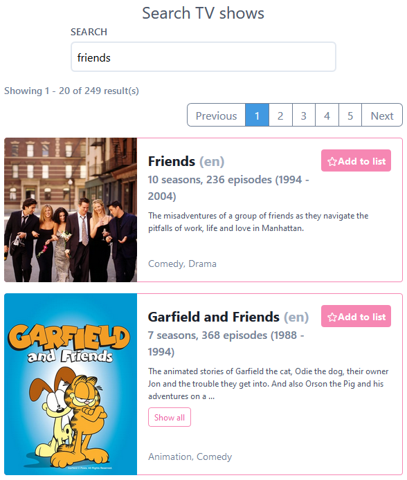
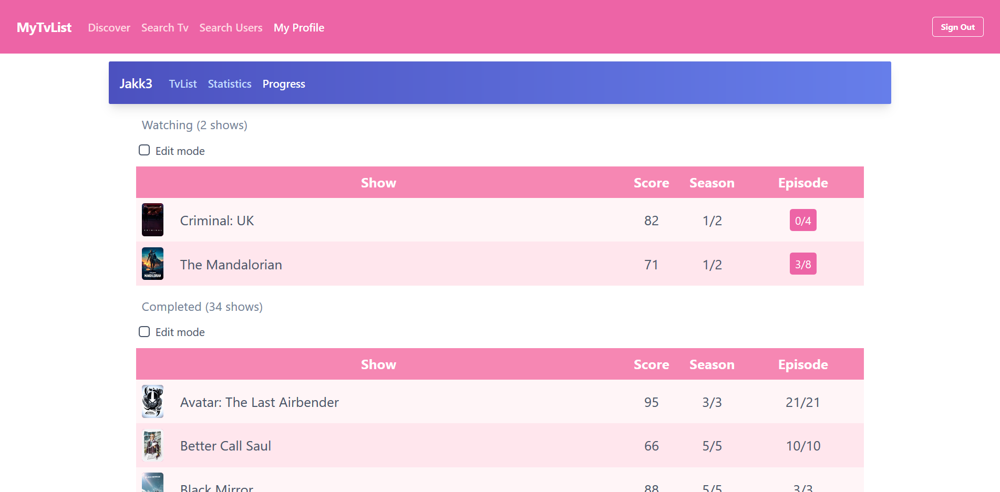
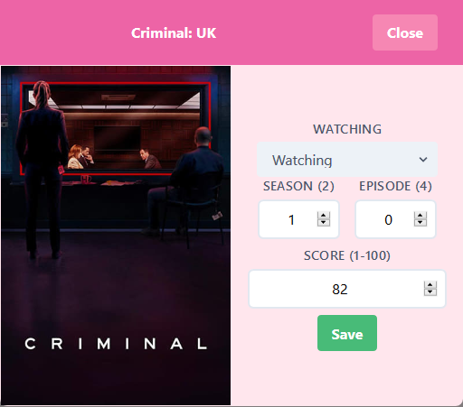
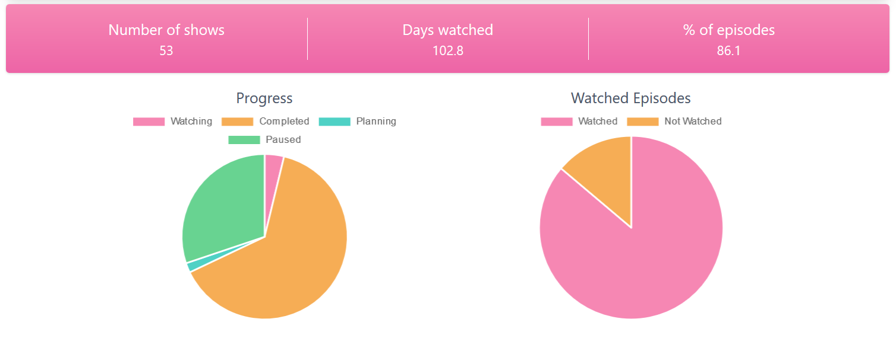

# MyTvList

MyTvList is a web app that can be used to add TV shows to your personal watchlist and mark progress on those shows. The app includes user profiles, which show the progress and some statistics based on the user's watchlist and progress. There is also search function for both TV shows and users.

[GitHub](https://github.com/vmuotka/mytvlist)
and
[Live](https://vmuotka-mytvlist.herokuapp.com/user/jakk3)

## What I used

Front-end
- React (react-router)
- axios
- [Chart.js](https://www.chartjs.org/)
- [TailwindCSS](https://tailwindcss.com/)

Back-end
- [TheMovieDB](https://developers.themoviedb.org/3/getting-started/introduction)
- Node (Express)
- axios
- bcrypt
- jsonwebtoken
- MongoDB (mongoose)

I have previously used [Material-UI](https://material-ui.com/) for components, but wanted to have more control over the visuality and functionality of my components. I decided to create my own components and use TailwindCSS, which creates global utility CSS classes.

## Project journey

I started this project by creating user registeration and sign in. I ended up doing it with bcrypt and jsonwebtoken, saving the the token to localStorage. I also set an expiration date for the token (currently 7 days from creating it). On the server side, I save the user and their hashed password to MongoDB using mongoose.

### Search
After that I created the search function for TV shows. I send the user's query to my back-end, where I form the API request. I get the data from [The Movie Database](https://developers.themoviedb.org/3/getting-started/introduction). There are two main reasons that I make the request from the back-end. The first one is that the API requires the usage of API key, and I want to keep that private. The second one is that to make load times faster and reduce the amount of API calls, I store the data returned by the API to my database for a day. 



### Progress
After adding shows to your list, they will show up on your profile. On the progress tab, users can keep track of their progress. Shows are filtered into four categories: **planning** (0 episodes watched), **watching** (some episodes watched), **completed** (all episodes watched) and **paused** (user can manually set).

The tables show how many episodes and seasons the user has completed of each show. Episode count can be increased by clicking on the button. Filling up the episode count for a season increases the season counter.

Each table also has an edit mode, which allows users to select multiple rows and complete/reset/pause/unpause them all.



While hovering on a table row, the poster image is replaced by an expand button. Clicking that button opens a progress modal, that can be used to set progress precisely, set the watching status and give the show a score.



I store the progress as an simple object.

```json
{
  ...
  progress: {
    season: 3,
    episode: 7
  }
  ...
}
```

 I didn't want to save every episode id that the user had watched and go through that array every time I had to calculate progress. With this approach, I can't mark singular episodes as watched, but its not required in most cases.

### Statistics

I tested a couple of chart libraries (Victory, Recharts) made for React before I ended up installing Chart.js and creating my own charts with it. I was having problems with getting the charts to be responsive and some chart labels were being cut off. I also didn't like the visual style of those libraries, but Chart.js is visually pleasant.



You can view [my profile](https://vmuotka-mytvlist.herokuapp.com/user/jakk3) for a more detailed example.

### Discover

The Movie Database API offers a discover route that I used to return popular shows in the last 6 months. They also have recommendations based on a show. I sorted the user's show list by score (shows without score are at the end). To reduce initial load time, I implemented infinity scroll that loads only a couple of recommendations at a time.


## Planned features

I have implemented most of the main features, but the project is still ongoing. Some things I still want to add are:

- langing page
- user settings
- rewatch button
- show details page
- user bios